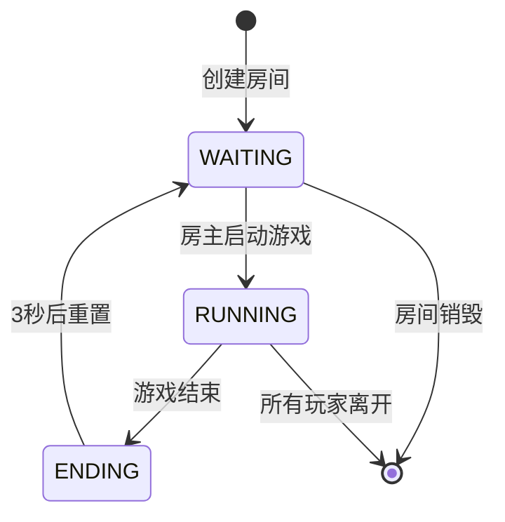
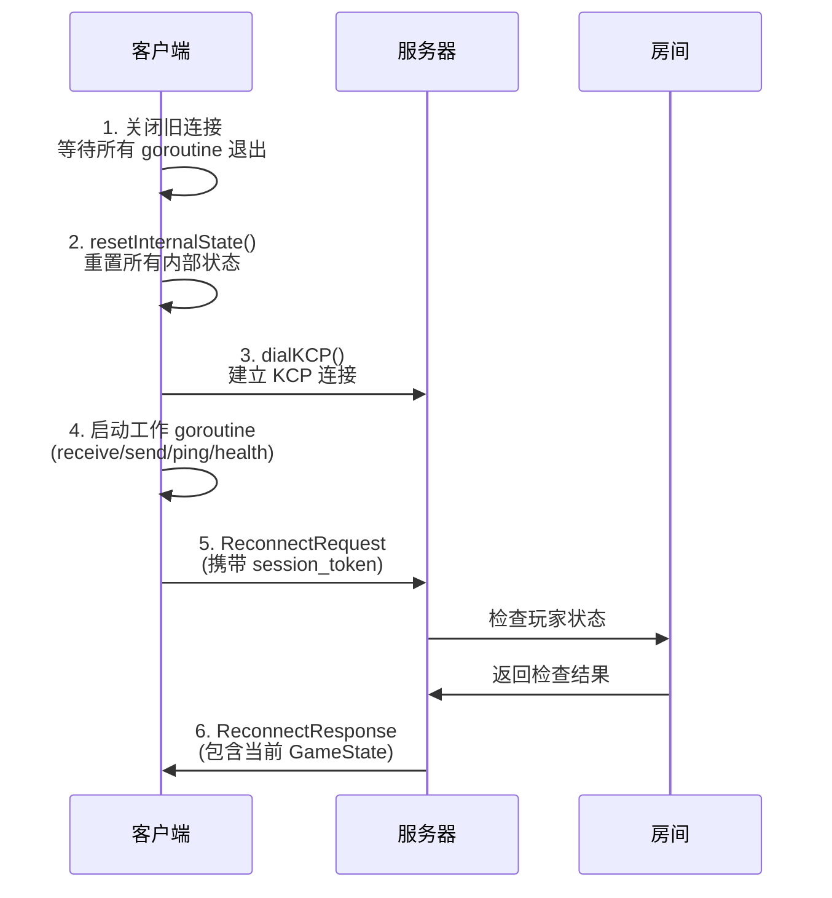
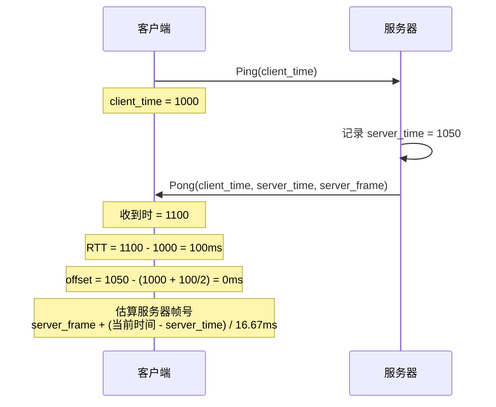
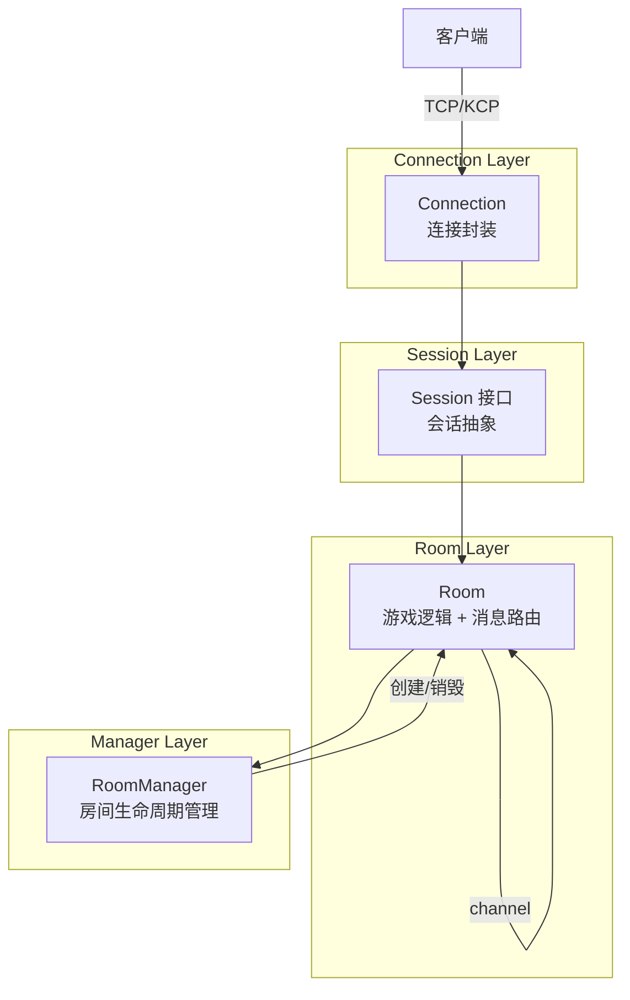
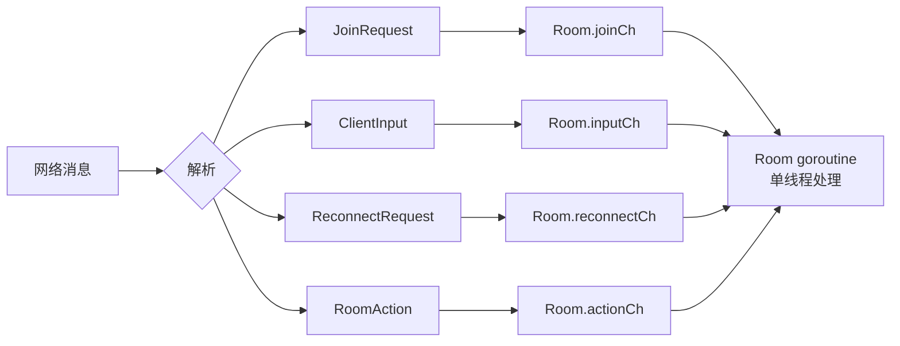
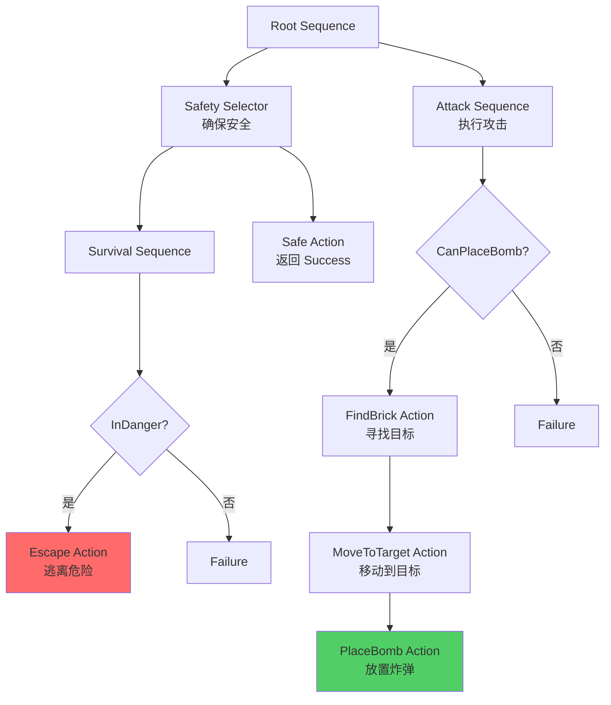
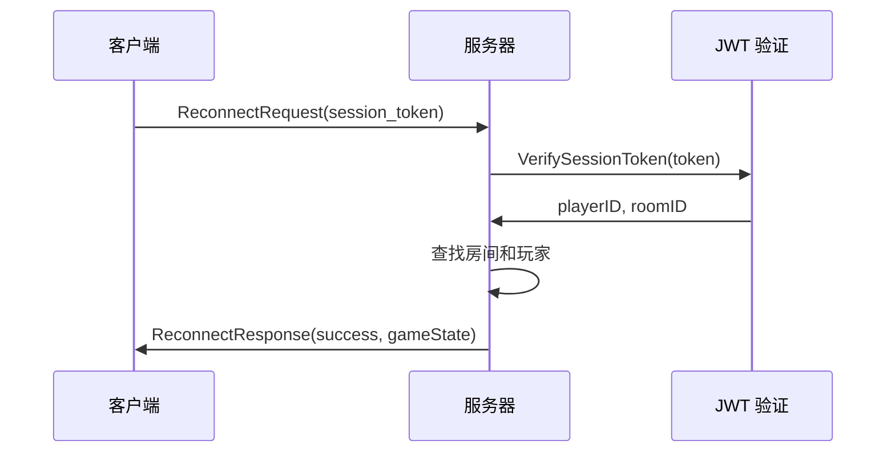
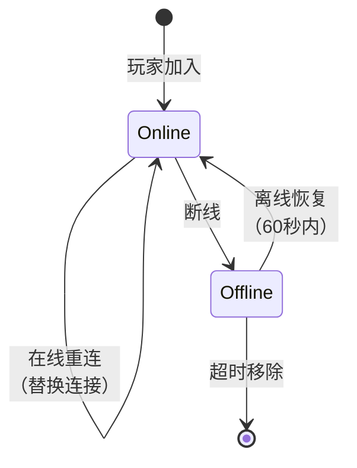
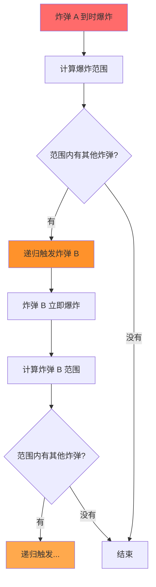
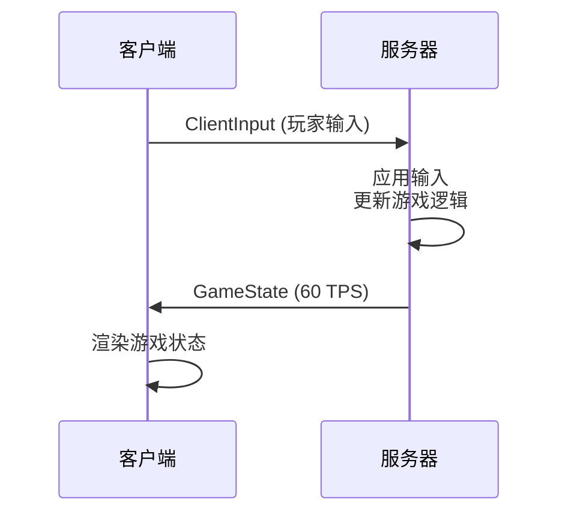

# Bomberman 多人联机游戏 - 答辩文档

## 项目概述

### 项目简介

Bomberman 是一个使用 Go 语言和 Ebiten 游戏引擎开发的多人在线联机游戏，采用**权威服务器架构**，实现了完整的房间匹配、断线重连、弱网适配等功能。项目核心逻辑与网络层完全解耦，支持多人实时对战。

### 核心特性

| 特性 | 描述 |
|------|------|
| 权威服务器 | 服务器维护唯一游戏状态，60 TPS 游戏循环，客户端只负责渲染和输入 |
| 大厅匹配系统 | 房间列表展示、创建/加入房间、准备开始、AI 填充 |
| 断线重连 | 断线后 60 秒内可重连，使用 KCP 协议快速恢复连接 |
| TCP/KCP 双协议 | TCP 保证可靠传输，KCP 提供低延迟体验 |
| 平滑插值渲染 | 其他玩家使用 LERP 插值避免位置跳跃 |
| AI 对战系统 | 基于行为树的智能 AI，支持危险感知和战术决策 |

### 技术栈

- **语言**: Go 1.21+
- **游戏引擎**: Ebiten (2D 游戏引擎)
- **网络协议**: Protobuf (序列化) + TCP/KCP (传输)
- **架构模式**: 权威服务器 + 房间隔离

---

## 一、功能介绍

### 1.1 房间功能

#### 房间状态流转

房间采用明确的状态机设计，支持三种状态的平滑流转：



**实现位置**: [internal/server/room.go:227-270](internal/server/room.go#L227-L270)

```go
// 房间状态枚举
type GameState int

const (
    StateWaiting GameState = iota  // 等待玩家
    StateRunning                   // 游戏进行中
    StateEnding                    // 游戏结算中
)

func (r *Room) tick() {
    now := time.Now()

    // 结束状态 → 等待状态（3秒后重置）
    if r.state == StateEnding && !r.resetAt.IsZero() && now.After(r.resetAt) {
        r.resetRoom()
        return
    }

    // 等待状态不处理游戏逻辑
    if r.state != StateRunning {
        return
    }

    // 游戏进行中：应用输入、更新AI、更新游戏
    r.applyInputs()
    r.updateAI()
    r.game.Update()
    // ...
}
```

#### 房间管理

**RoomManager** 负责房间的生命周期管理：

| 功能 | 描述 | 实现位置 |
|------|------|----------|
| 房间创建 | 支持自动分配ID和自定义ID | [room_manager.go:336-364](internal/server/room_manager.go#L336-L364) |
| 房间清理 | 每5秒清理空房间（保留默认房间） | [room_manager.go:53-88](internal/server/room_manager.go#L53-L88) |
| 房间查询 | 分页查询房间列表 | [room_manager.go:197-233](internal/server/room_manager.go#L197-L233) |

```go
const (
    MaxRooms         = 100       // 最大房间数
    RoomEmptyTimeout = 60        // 房间空置超时（秒）
)

// cleanupLoop 定期清理空房间
func (m *RoomManager) cleanupLoop() {
    defer m.wg.Done()
    ticker := time.NewTicker(5 * time.Second)
    for {
        select {
        case <-m.ctx.Done():
            return
        case <-ticker.C:
            m.cleanupEmptyRooms()
        }
    }
}
```

#### 匹配逻辑

支持多种加入方式，满足不同场景需求：

| room_id 参数 | 行为 |
|--------------|------|
| `""` | 快速匹配：查找 WAITING 状态且未满的房间 |
| `"CREATE"` | 强制创建新房间（自动分配ID） |
| `"CREATE:custom_id"` | 创建自定义ID的房间 |
| `"room_xxx"` | 加入指定ID的房间 |

**实现位置**: [internal/server/room_manager.go:116-145](internal/server/room_manager.go#L116-L145)

```go
func (m *RoomManager) Join(session Session, req JoinEvent) error {
    roomID := req.RoomID

    // 处理 "CREATE:custom_id" 格式
    if len(roomID) > 7 && roomID[:7] == "CREATE:" {
        customID := roomID[7:]
        if customID == "" {
            roomID = m.CreateRoom()
        } else {
            roomID = m.CreateRoomWithID(customID)
        }
    } else {
        switch roomID {
        case "":
            // 快速匹配
            roomID = m.findAvailableRoom()
            if roomID == "" {
                roomID = m.CreateRoom()
            }
        case "CREATE":
            roomID = m.CreateRoom()
        default:
            // 指定房间
            if !m.roomExists(roomID) {
                return fmt.Errorf("Room %s not found", roomID)
            }
        }
    }
    // ...
}
```

---

### 1.2 断线重连

#### 客户端健康检测

客户端通过定期检查最后收包时间来检测断线：

**实现位置**: [internal/client/network.go:1071-1105](internal/client/network.go#L1071-L1105)

```go
// checkHealthLoop 定期检查连接健康状态
func (nc *NetworkClient) checkHealthLoop() {
    defer nc.wg.Done()

    ticker := time.NewTicker(1 * time.Second)
    defer ticker.Stop()

    // 5 秒没收到包视为断线
    timeout := 5 * time.Second

    for {
        select {
        case <-nc.ctx.Done():
            return
        case <-ticker.C:
            lastTime, ok := nc.lastPacketTime.Load().(time.Time)
            if !ok {
                continue
            }
            if time.Since(lastTime) > timeout {
                log.Printf("心跳超时，断开连接")
                if nc.connected {
                    select {
                    case nc.errChan <- fmt.Errorf("connection timeout"):
                    default:
                    }
                    nc.closeConn()
                }
                return
            }
        }
    }
}
```

#### 重连流程

完整的重连流程包含 6 个关键步骤：



**实现位置**: [internal/client/network.go:836-914](internal/client/network.go#L836-L914)

```go
func (nc *NetworkClient) Reconnect() (*gamev1.GameState, error) {
    // 1. 关闭旧连接，等待所有 goroutine 结束
    nc.connected = false
    nc.cancel()
    if nc.conn != nil {
        nc.conn.Close()
    }
    nc.wg.Wait()

    // 2. 重置所有内部状态（关键！）
    nc.resetInternalState()

    // 3. 重新建立连接（重连时使用 KCP）
    conn, err := nc.dialKCP()
    if err != nil {
        return nil, fmt.Errorf("重连失败: %w", err)
    }
    nc.conn = conn
    nc.connected = true

    // 4. 启动工作 goroutine
    nc.wg.Add(1)
    go nc.receiveLoop()
    nc.wg.Add(1)
    go nc.sendLoop()
    nc.wg.Add(1)
    go nc.pingLoop()
    nc.wg.Add(1)
    go nc.checkHealthLoop()

    // 5. 发送重连请求
    if err := nc.sendReconnectRequest(); err != nil {
        nc.Close()
        return nil, fmt.Errorf("发送重连请求失败: %w", err)
    }

    // 6. 等待重连响应
    select {
    case resp := <-nc.reconnectRespChan:
        if !resp.Success {
            return nil, fmt.Errorf("重连失败: %s", resp.ErrorMessage)
        }
        return resp.CurrentState, nil
    case <-time.After(10 * time.Second):
        return nil, errors.New("等待重连响应超时")
    }
}
```

**关键：状态重置函数** [internal/client/network.go:918-959](internal/client/network.go#L918-L959)

```go
func (nc *NetworkClient) resetInternalState() {
    // 1. 重建 context
    ctx, cancel := context.WithCancel(context.Background())
    nc.ctx = ctx
    nc.cancel = cancel

    // 2. 清空并重建所有通道
    nc.drainChannels()
    nc.stateChan = make(chan *gamev1.GameState, 256)
    nc.eventChan = make(chan *gamev1.GameEvent, 64)
    // ... 重建所有通道

    // 3. 重置输入序列号
    nc.inputSeq = 0

    // 4. 重置 RTT 统计
    nc.rttSamples = make([]int64, rttSampleWindow)

    // 5. 重置时间同步
    nc.timeOffsetMs = 0
}
```

#### 服务器端离线玩家保护

服务器采用"软删除"策略，断线玩家保留 60 秒：

**实现位置**: [internal/server/room.go:494-523](internal/server/room.go#L494-L523)

```go
// handleLeave 处理玩家离开（网络断开或超时）
// 默认为软删除（断线保护），除非超时
func (r *Room) handleLeave(playerID int32) {
    // 如果是 AI，直接硬删除
    if _, isAI := r.aiControllers[playerID]; isAI {
        r.handleForceLeave(playerID)
        return
    }

    // 如果玩家在线，转为离线状态
    if conn, ok := r.connections[playerID]; ok {
        log.Printf("玩家 %d 断线，进入保留状态", playerID)
        r.offlinePlayers[playerID] = time.Now()  // 记录断线时间
        delete(r.connections, playerID)

        // 清理连接相关但不清理游戏数据
        delete(r.sendQueueFullAt, playerID)
        conn.SetPlayerID(-1)
        conn.SetRoomID("")

        // 不广播 PlayerLeft，也不从 game.Players 移除
        // 这样玩家在游戏中会停留在原地
        return
    }
}

// 超时后强制移除
func (r *Room) tick() {
    // ...
    // 清理超时离线玩家
    for playerID, disconnectTime := range r.offlinePlayers {
        if time.Since(disconnectTime) > OfflinePlayerTimeout {
            log.Printf("玩家 %d 离线超时，强制移除", playerID)
            r.handleForceLeave(playerID)
        }
    }
}
```

#### 重连支持两种模式

**实现位置**: [internal/server/room.go:1134-1165](internal/server/room.go#L1134-L1165)

```go
func (r *Room) handleReconnect(req reconnectRequest) {
    // 检查是否在线
    if _, ok := r.connections[req.playerID]; ok {
        // 玩家在线，替换连接（在线重连）
        r.connections[req.playerID] = req.conn
        log.Printf("玩家 %d 在线重连，连接已替换", req.playerID)
        req.respCh <- true
        return
    }

    // 检查是否离线保留中
    if _, ok := r.offlinePlayers[req.playerID]; ok {
        // 玩家离线，恢复连接（离线恢复）
        delete(r.offlinePlayers, req.playerID)
        r.connections[req.playerID] = req.conn
        log.Printf("玩家 %d 从离线状态重连成功", req.playerID)
        req.respCh <- true
        return
    }

    req.respCh <- false
}
```

---

### 1.3 弱网适配

#### TCP/KCP 双协议支持

项目支持两种传输协议，可根据场景选择：

| 协议 | 特点 | 使用场景 |
|------|------|----------|
| TCP | 可靠传输，使用 TCP_NODELAY 禁用 Nagle 算法 | 初始连接、重要消息传输 |
| KCP | 基于 UDP 的可靠传输，低延迟模式 | 重连、实时对战 |

**实现位置**: [internal/client/network.go:147-185](internal/client/network.go#L147-L185)

```go
func (nc *NetworkClient) dial() (net.Conn, error) {
    switch nc.proto {
    case "", "tcp":
        conn, err := net.DialTimeout("tcp", nc.serverAddr, 5*time.Second)
        if err != nil {
            return nil, err
        }
        // 开启 TCP_NODELAY，禁用 Nagle 算法以减少延迟
        if tcpConn, ok := conn.(*net.TCPConn); ok {
            tcpConn.SetNoDelay(true)
        }
        return conn, nil
    case "kcp":
        conn, err := kcp.DialWithOptions(nc.serverAddr, nil, 0, 0)
        if err != nil {
            return nil, err
        }
        return conn, nil
    default:
        return nil, fmt.Errorf("不支持的协议: %s", nc.proto)
    }
}

// dialKCP 使用 KCP 协议建立连接（用于重连）
func (nc *NetworkClient) dialKCP() (net.Conn, error) {
    conn, err := kcp.DialWithOptions(nc.serverAddr, nil, 0, 0)
    if err != nil {
        return nil, err
    }
    // 配置 KCP 参数以获得更低延迟
    conn.SetStreamMode(true)     // 使用流模式处理消息边界
    conn.SetNoDelay(1, 10, 2, 1) // nodelay=1, interval=10ms, resend=2, nc=1
    conn.SetWindowSize(128, 128)
    conn.SetMtu(1400)
    conn.SetACKNoDelay(true)
    return conn, nil
}
```

**KCP 参数说明**：
- `SetNoDelay(1, 10, 2, 1)`: 启用无延迟模式，发送间隔 10ms，重传 2 次，关闭快速重传
- `SetWindowSize(128, 128)`: 发送和接收窗口各 128
- `SetMtu(1400)`: MTU 设为 1400 字节

#### 传输层抽象设计

服务器端通过接口抽象，实现协议无关的连接管理：

**实现位置**: [internal/server/listener.go](internal/server/listener.go)

```go
// ServerListener 传输层监听器接口
type ServerListener interface {
    Accept() (net.Conn, error)
    Close() error
    Addr() net.Addr
}

// TCP 监听器
type tcpListener struct {
    listener *net.TCPListener
}

// KCP 监听器
type kcpListener struct {
    listener *kcp.Listener
}

// 工厂函数统一创建
func newListener(proto, addr string) (ServerListener, error) {
    switch proto {
    case "", "tcp":
        ln, err := net.Listen("tcp", addr)
        if err != nil {
            return nil, err
        }
        return &tcpListener{listener: ln.(*net.TCPListener)}, nil
    case "kcp":
        ln, err := kcp.ListenWithOptions(addr, nil, 0, 0)
        if err != nil {
            return nil, err
        }
        return &kcpListener{listener: ln}, nil
    default:
        return nil, fmt.Errorf("不支持的协议: %s", proto)
    }
}
```

---

## 二、架构设计

### 2.1 协议设计

#### Protobuf 消息定义

使用 Protobuf 定义消息格式，保证跨语言兼容性和高效序列化：

**定义位置**: [api/proto/bomberman/v1/game.proto](api/proto/bomberman/v1/game.proto)

```protobuf
// 统一的消息包装
message Packet {
    MessageType type = 1;      // 消息类型
    bytes payload = 2;         // Protobuf 编码的消息体
}

// 消息类型枚举
enum MessageType {
    MESSAGE_TYPE_UNKNOWN = 0;
    MESSAGE_TYPE_JOIN_REQUEST = 1;
    MESSAGE_TYPE_JOIN_RESPONSE = 2;
    MESSAGE_TYPE_CLIENT_INPUT = 3;
    MESSAGE_TYPE_GAME_STATE = 4;
    MESSAGE_TYPE_GAME_EVENT = 5;
    MESSAGE_TYPE_PING = 6;
    MESSAGE_TYPE_PONG = 7;
    MESSAGE_TYPE_RECONNECT_REQUEST = 8;
    MESSAGE_TYPE_RECONNECT_RESPONSE = 9;
    MESSAGE_TYPE_ROOM_LIST_REQUEST = 10;
    MESSAGE_TYPE_ROOM_LIST_RESPONSE = 11;
    MESSAGE_TYPE_ROOM_ACTION = 12;
    MESSAGE_TYPE_ROOM_ACTION_RESPONSE = 13;
    MESSAGE_TYPE_ROOM_STATE_UPDATE = 14;
}
```

#### 消息分类

**客户端 → 服务器**:

| 消息类型 | 用途 |
|----------|------|
| JoinRequest | 加入房间（room_id="" 表示快速匹配） |
| ClientInput | 玩家输入（含多帧数据和序列号） |
| ReconnectRequest | 重连请求（携带 session_token） |
| RoomAction | 房间操作（准备/开始/离开/踢人/添加AI） |
| RoomListRequest | 请求房间列表 |

**服务器 → 客户端**:

| 消息类型 | 用途 |
|----------|------|
| JoinResponse | 加入成功，包含 session_token、游戏配置 |
| GameState | 完整游戏状态（60 TPS 广播） |
| GameEvent | 游戏事件（玩家死亡、游戏开始/结束等） |
| ReconnectResponse | 重连成功，包含当前游戏状态 |
| RoomStateUpdate | 房间状态更新（玩家列表、准备状态等） |
| RoomActionResponse | 房间操作响应 |
| Ping/Pong | 时间同步和延迟测量 |

#### 消息序列化

**实现位置**: [pkg/protocol/codec.go](pkg/protocol/codec.go)

```go
// 长度前缀协议：4 字节长度 + Protobuf 数据
func MarshalPacket(pkt *gamev1.Packet) ([]byte, error) {
    payload, err := proto.Marshal(pkt)
    if err != nil {
        return nil, err
    }

    // 4 字节长度前缀（大端序）
    data := make([]byte, 4+len(payload))
    binary.BigEndian.PutUint32(data[:4], uint32(len(payload)))
    copy(data[4:], payload)

    return data, nil
}

func UnmarshalPacket(data []byte) (*gamev1.Packet, error) {
    if len(data) < 4 {
        return nil, errors.New("packet too short")
    }

    length := binary.BigEndian.Uint32(data[:4])
    if uint32(len(data)) < 4+length {
        return nil, errors.New("incomplete packet")
    }

    pkt := &gamev1.Packet{}
    if err := proto.Unmarshal(data[4:4+length], pkt); err != nil {
        return nil, err
    }

    return pkt, nil
}
```

---

### 2.2 基于帧的同步机制

#### 帧同步设计

游戏采用**帧同步**设计，所有时间单位统一转换为帧：

**实现位置**: [pkg/core/constants.go:43-63](pkg/core/constants.go#L43-L63)

```go
const (
    // 服务器 Tick 频率
    TPS           = 60                // Ticks Per Second
    FrameDuration = time.Second / TPS // 每帧时长 ≈ 16.67ms
    FrameSeconds  = 1.0 / TPS         // 每帧秒数
)

const (
    // 炸弹相关（帧 = 秒数 × TPS）
    BombFuseFrames           = 180 // 炸弹引爆时间：3秒 × 60 = 180帧
    BombExplosionFrames      = 30  // 爆炸持续时间：0.5秒 × 60 = 30帧
    BombPlacementDelayFrames = 12  // 炸弹放置防抖：0.2秒 × 60 = 12帧
    BombExplosionRange       = 2   // 默认爆炸范围：2格
    BombMaxCountDefault      = 2   // 默认可同时放置炸弹数

    // 玩家相关
    PlayerSpeedPerFrame = 2.0 // 像素/帧 = 120像素/秒 ÷ 60

    // AI 相关
    AIThinkIntervalFrames       = 6  // 100ms × 60 ≈ 6帧
    AIThinkIntervalDangerFrames = 2  // 危险时思考间隔 ≈ 2帧
    AIStuckThresholdFrames      = 60 // 卡住判定 = 1秒 × 60

    // 游戏流程
    GameStartCountdownFrames = 180       // 开始倒计时：3秒
    GameOverDelayFrames      = 300       // 结束延时：5秒
    MatchDurationFrames      = 120 * TPS // 对局时长：2分钟（<=0 关闭限时）
)

// SecondsToFrames 秒转帧（用于配置转换）
func SecondsToFrames(seconds float64) int {
    return int(seconds * TPS)
}

// FramesToSeconds 帧转秒（用于显示）
func FramesToSeconds(frames int) float64 {
    return float64(frames) / float64(TPS)
}

// FramesToMillis 帧转毫秒（用于网络延迟计算）
func FramesToMillis(frames int) int64 {
    return int64(frames) * 1000 / TPS
}
```

#### 炸弹帧同步

炸弹的生命周期完全由帧号控制：

**实现位置**: [pkg/core/bomb.go:8-49](pkg/core/bomb.go#L8-L49)

```go
// Bomb 炸弹
type Bomb struct {
    GridX int // 格子坐标X
    GridY int // 格子坐标Y

    // 时间（帧为单位）
    ExplodeAtFrame int32 // 引爆帧号
    PlacedAtFrame  int32 // 放置时的帧号

    // 属性
    ExplosionRange int // 爆炸范围（格子数）
    OwnerID        int // 放置者 ID

    // 状态
    Exploded bool // 是否已爆炸（用于连锁爆炸）
}

// NewBomb 创建新炸弹
func NewBomb(gridX, gridY int, ownerID int, currentFrame int32) *Bomb {
    return &Bomb{
        GridX:          gridX,
        GridY:          gridY,
        ExplodeAtFrame: currentFrame + BombFuseFrames, // 3秒后爆炸
        PlacedAtFrame:  currentFrame,
        ExplosionRange: BombExplosionRange,
        OwnerID:        ownerID,
        Exploded:       false,
    }
}

// IsExploded 检查炸弹是否已爆炸
func (b *Bomb) IsExploded(frameId int32) bool {
    return frameId >= b.ExplodeAtFrame
}

// Update 每帧更新炸弹，返回是否应该爆炸
func (b *Bomb) Update(frameId int32) bool {
    if b.Exploded {
        return false // 已处理
    }
    return frameId >= b.ExplodeAtFrame
}
```

#### 爆炸帧同步

爆炸效果也有明确的帧生命周期：

**实现位置**: [pkg/core/explosion.go:3-44](pkg/core/explosion.go#L3-L44)

```go
// Explosion 爆炸效果
type Explosion struct {
    GridX          int       // 中心格子X
    GridY          int       // 中心格子Y
    Range          int       // 爆炸范围
    ExpiresAtFrame int32     // 结束帧号
    CreatedAtFrame int32     // 创建帧号
    Cells          []GridPos // 影响的格子
    OwnerID        int       // 来源炸弹的所有者
    // 地图变化（用于客户端同步）
    TileChanges []TileChange // 爆炸导致的地图变化
}

// NewExplosion 创建新爆炸
func NewExplosion(bomb *Bomb, currentFrame int32) *Explosion {
    return &Explosion{
        GridX:          bomb.GridX,
        GridY:          bomb.GridY,
        Range:          bomb.ExplosionRange,
        ExpiresAtFrame: currentFrame + BombExplosionFrames, // 30帧后消失
        CreatedAtFrame: currentFrame,
        Cells:          []GridPos{},
        OwnerID:        bomb.OwnerID,
    }
}

// IsExpired 检查爆炸是否已结束
func (e *Explosion) IsExpired(frameId int32) bool {
    return frameId >= e.ExpiresAtFrame
}
```

#### RTT 帧预测

客户端通过心跳包测量 RTT，并预测服务器当前帧号：

**实现位置**: [internal/client/network.go:590-774](internal/client/network.go#L590-L774)

```go
func (nc *NetworkClient) handlePong(pong *gamev1.Pong) {
    now := time.Now().UnixMilli()
    rtt := now - pong.ClientTime  // 计算往返时间

    // 记录 RTT 采样（滑动窗口）
    nc.rttSamples[nc.rttIndex] = rtt
    nc.rttIndex = (nc.rttIndex + 1) % rttSampleWindow
    if nc.rttSampleCount < rttSampleWindow {
        nc.rttSampleCount++
    }

    // 计算时间偏移（用于估算服务器时间）
    measuredOffset := pong.ServerTime - (pong.ClientTime + rtt/2)
    prev := atomic.LoadInt64(&nc.timeOffsetMs)
    if prev == 0 {
        atomic.StoreInt64(&nc.timeOffsetMs, measuredOffset)
    } else {
        // 指数平滑
        smoothed := int64(float64(prev)*0.9 + float64(measuredOffset)*0.1)
        atomic.StoreInt64(&nc.timeOffsetMs, smoothed)
    }

    atomic.StoreInt64(&nc.lastRTTMs, rtt)
    atomic.StoreInt64(&nc.lastServerTimeMs, pong.ServerTime)
    atomic.StoreInt32(&nc.lastServerFramePong, pong.ServerFrame)
}

// EstimatedServerTimeMs 估算服务器时间（毫秒）
func (nc *NetworkClient) EstimatedServerTimeMs() int64 {
    offset := atomic.LoadInt64(&nc.timeOffsetMs)
    if offset == 0 {
        return 0
    }
    return time.Now().UnixMilli() + offset
}

// EstimatedServerFrame 估算服务器当前帧号
func (nc *NetworkClient) EstimatedServerFrame() int32 {
    lastTime := atomic.LoadInt64(&nc.lastServerTimeMs)
    lastFrame := atomic.LoadInt32(&nc.lastServerFramePong)
    if lastTime == 0 {
        return nc.lastServerFrame
    }

    now := nc.EstimatedServerTimeMs()
    if now == 0 {
        return nc.lastServerFrame
    }

    // 根据时间差推算帧号
    deltaMs := now - lastTime
    if deltaMs <= 0 {
        return lastFrame
    }

    frameStep := 1000.0 / float64(core.TPS)  // 每帧约 16.67ms
    advance := int32(float64(deltaMs) / frameStep)
    return lastFrame + advance
}
```

**时间同步示意图**：



#### 帧同步的优势

| 优势 | 说明 |
|------|------|
| 确定性 | 所有玩家看到相同的帧状态，便于调试和回放 |
| 简化逻辑 | 不需要处理 deltaTime 和浮点误差 |
| 网络友好 | 帧号可以作为输入去重的依据 |
| RTT 适应 | 客户端根据 RTT 调整预测，减少视觉延迟 |

---

### 2.3 增量消息

#### GameState 增量更新机制

为了减少网络传输量，服务器只发送必要的增量数据：

**实现位置**: [internal/server/room.go:1011-1069](internal/server/room.go#L1011-L1069)

```go
func (r *Room) broadcastState() {
    // 转换玩家列表
    protoPlayers := protocol.CorePlayersToProto(r.game.Players)

    // 转换炸弹列表
    protoBombs := protocol.CoreBombsToProto(r.game.Bombs)

    // 转换爆炸列表
    protoExplosions := protocol.CoreExplosionsToProto(r.game.Explosions)

    // 收集地图变化（从爆炸中收集）
    var tileChanges []*gamev1.TileChange
    for _, exp := range r.game.Explosions {
        for _, tc := range exp.TileChanges {
            tileChanges = append(tileChanges, &gamev1.TileChange{
                X:       int32(tc.GridX),
                Y:       int32(tc.GridY),
                NewType: gamev1.TileType(tc.NewType),
            })
        }
    }

    // 构造 GameState 消息（包含帧号和增量变化）
    packet, err := protocol.NewGameStatePacket(
        r.frameID,
        protocol.CoreGameStateToProto(int(r.state)),
        protoPlayers,
        protoBombs,
        protoExplosions,
        tileChanges,  // 增量地图变化
        r.lastProcessedInputSeq,  // 输入序号追踪
        r.matchEndFrame,
    )
    // ...
}
```

#### 地图增量策略

- **初始状态**: 游戏开始时通过 `GameStartEvent` 发送完整地图
- **游戏期间**: 只发送爆炸清除的砖块变化（TileChange）
- **优势**: 避免每帧发送 20×15 = 300 个格子的完整地图

#### 输入序号追踪

服务器记录每个玩家最后处理的输入序号，用于网络优化：

**实现位置**: [internal/server/room.go:488-492](internal/server/room.go#L488-L492)

```go
func (r *Room) handleInput(ev inputEvent) {
    // 处理输入数据...

    // 更新最后处理的输入序号
    if ev.input.Seq > r.lastProcessedInputSeq[ev.playerID] {
        r.lastProcessedInputSeq[ev.playerID] = ev.input.Seq
    }
}

// 广播时包含序号信息
packet, err := protocol.NewGameStatePacket(
    // ...
    r.lastProcessedInputSeq,
    // ...
)
```

---

### 2.3 conn-session-room-manager 架构

项目采用四层架构，层次清晰，职责分明：



#### 连接层 (Connection)

**实现位置**: [internal/server/connection.go](internal/server/connection.go)

```go
// Connection 连接包装
type Connection struct {
    conn     net.Conn           // 底层连接
    playerID int32              // 玩家 ID
    roomID   string             // 房间 ID
    sendChan chan []byte        // 发送队列
    rateLimiter *rate.Limiter   // 全局消息限流器
}

// Send 发送消息（带限流保护）
func (c *Connection) Send(data []byte) error {
    // 限流检查：65 msg/s
    if !c.rateLimiter.Allow() {
        return ErrSendQueueFull
    }

    select {
    case c.sendChan <- data:
        return nil
    default:
        return ErrSendQueueFull
    }
}
```

#### 会话层 (Session)

**Session 接口**提供统一的会话操作：

```go
// Session 会话接口
type Session interface {
    ID() int32
    Send(data []byte) error
    SetPlayerID(id int32)
    SetRoomID(id string)
    Close()
    CloseWithoutNotify()
}
```

`Connection` 实现了 `Session` 接口，便于单元测试和扩展。

#### 房间层 (Room)

每个房间运行在独立的 goroutine 中，通过 channel 接收消息：

**实现位置**: [internal/server/room.go:126-160](internal/server/room.go#L126-L160)

```go
func (r *Room) Run(wg *sync.WaitGroup) {
    defer wg.Done()

    ticker := time.NewTicker(TickDuration)
    defer ticker.Stop()

    for {
        select {
        case <-r.ctx.Done():
            r.closeAllConnections(false)
            return

        case req := <-r.joinCh:      // 加入请求
            r.handleJoin(req)

        case req := <-r.reconnectCh: // 重连请求
            r.handleReconnect(req)

        case ev := <-r.inputCh:      // 玩家输入
            r.handleInput(ev)

        case playerID := <-r.leaveCh: // 玩家离开
            r.handleLeave(playerID)

        case req := <-r.actionCh:    // 房间操作
            r.handleRoomAction(req)

        case <-ticker.C:             // 游戏更新 (60 TPS)
            r.tick()
        }
    }
}
```

**消息路由流程**：



#### 管理层 (RoomManager)

**RoomManager** 负责房间生命周期管理：

**实现位置**: [internal/server/room_manager.go:21-50](internal/server/room_manager.go#L21-L50)

```go
type RoomManager struct {
    ctx         context.Context
    enableAI    bool
    nextRoomSeq int64
    rooms       map[string]*Room // 房间 ID -> 房间
    roomMutex   sync.RWMutex     // 保护 rooms map
    wg          sync.WaitGroup   // 等待组
    shutdown    chan struct{}    // 关闭信号
}

func (m *RoomManager) Run(wg *sync.WaitGroup) {
    // 启动房间清理协程
    m.wg.Add(1)
    go m.cleanupLoop()

    // 创建默认房间
    m.getOrCreateRoom(DefaultRoomID)
}
```

#### 架构优势

| 优势 | 说明 |
|------|------|
| 完全解耦 | `pkg/core` 无网络依赖，可独立运行 |
| 单线程房间 | 每房间一个 goroutine，避免锁竞争 |
| 消息隔离 | 通过 channel 传递消息，天然线程安全 |
| 水平扩展 | 可支持多个服务器实例 |

---

## 三、项目亮点

### 3.1 AI 系统

#### 行为树框架

采用模块化的行为树设计，支持灵活的 AI 决策逻辑：

**实现位置**: [pkg/ai/bt_framework.go](pkg/ai/bt_framework.go)

```go
// 节点执行状态
type Status int

const (
    StatusSuccess Status = iota
    StatusFailure
    StatusRunning
)

// 节点接口
type Node interface {
    Tick(bb *Blackboard) Status
}

// Sequence 顺序节点：遇 Failure 停止，全 Success 才 Success
type Sequence struct {
    Children []Node
}

func (s *Sequence) Tick(bb *Blackboard) Status {
    for _, child := range s.Children {
        status := child.Tick(bb)
        if status != StatusSuccess {
            return status
        }
    }
    return StatusSuccess
}

// Selector 选择节点：遇 Success 停止，全 Failure 才 Failure
type Selector struct {
    Children []Node
}

func (s *Selector) Tick(bb *Blackboard) Status {
    for _, child := range s.Children {
        status := child.Tick(bb)
        if status != StatusFailure {
            return status
        }
    }
    return StatusFailure
}
```

#### AI 决策逻辑

AI 的行为树结构如下：

**实现位置**: [pkg/ai/controller.go:14-66](pkg/ai/controller.go#L14-L66)



```go
func NewAIController(playerID int) *AIController {
    c := &AIController{PlayerID: playerID}

    // 1. 生存逻辑 (Sequence)
    survivalSeq := &Sequence{
        Children: []Node{
            &Condition{Check: condIsInDanger},
            &Action{Do: actEscape},
        },
    }

    // 安全选择器 (Selector)
    safetySelector := &Selector{
        Children: []Node{
            survivalSeq,
            &Action{Do: func(bb *Blackboard) Status { return StatusSuccess }},
        },
    }

    // 2. 攻击逻辑 (Sequence)
    attackSeq := &Sequence{
        Children: []Node{
            &Condition{Check: condCanPlaceBomb},
            &Action{Do: actFindBrick},
            &Action{Do: actMoveToTarget},
            &Action{Do: actPlaceBomb},
        },
    }

    // 根节点：顺序执行 安全检查 -> 攻击
    c.tree = &Sequence{
        Children: []Node{
            safetySelector,
            attackSeq,
        },
    }

    return c
}
```

#### 危险感知

AI 通过 **DangerField** 感知周围环境，评估危险程度：

**实现位置**: [pkg/ai/danger.go](pkg/ai/danger.go)

```go
// DangerField 危险场
type DangerField struct {
    // width x height 的危险等级网格
    grid [][]int
    // 炸弹爆炸范围预测
    bombRanges map[*core.Bomb][]GridPos
}

// Update 更新危险场
func (d *DangerField) Update(game *core.Game) {
    // 重置危险场
    d.grid = make([][]int, game.MapWidth)

    // 遍历所有炸弹
    for _, bomb := range game.Bombs {
        // 计算爆炸范围
        cells := d.getExplosionRange(bomb, game)
        d.bombRanges[bomb] = cells

        // 标记危险区域
        for _, cell := range cells {
            d.grid[cell.GridX][cell.GridY]++
        }
    }
}
```

AI 决策时优先避开高危险区域，确保生存。

---

### 3.2 断线重连

完整的断线重连机制是项目的核心亮点：

#### 基于 JWT 的会话令牌设计

使用 JWT (JSON Web Token) 作为会话令牌，提供安全的身份验证：

**实现位置**: [internal/server/jwt.go](internal/server/jwt.go)

```go
// JWT 相关配置
const (
    // Session 有效期：5 分钟（一局游戏的时间）
    SessionTTL = 5 * time.Minute
    // Token 签名者
    tokenIssuer = "bomberman-server"
)

// Claims 定义 JWT Claims
type Claims struct {
    PlayerID int32  `json:"player_id"`
    RoomID   string `json:"room_id,omitempty"`
    jwt.RegisteredClaims
}

// GenerateSessionToken 生成会话 Token
func GenerateSessionToken(playerID int32, roomID string) (string, error) {
    now := time.Now()
    claims := Claims{
        PlayerID: playerID,
        RoomID:   roomID,
        RegisteredClaims: jwt.RegisteredClaims{
            Issuer:    tokenIssuer,
            Subject:   fmt.Sprintf("player-%d", playerID),
            ExpiresAt: jwt.NewNumericDate(now.Add(SessionTTL)),
            IssuedAt:  jwt.NewNumericDate(now),
        },
    }

    token := jwt.NewWithClaims(jwt.SigningMethodHS256, claims)
    return token.SignedString(getSigningKey())
}

// VerifySessionToken 验证并解析 Token
func VerifySessionToken(tokenString string) (int32, string, error) {
    token, err := jwt.ParseWithClaims(tokenString, &Claims{}, func(token *jwt.Token) (interface{}, error) {
        // 验证签名算法
        if _, ok := token.Method.(*jwt.SigningMethodHMAC); !ok {
            return nil, fmt.Errorf("unexpected signing method: %v", token.Header["alg"])
        }
        return getSigningKey(), nil
    })

    if claims, ok := token.Claims.(*Claims); ok && token.Valid {
        return claims.PlayerID, claims.RoomID, nil
    }

    return 0, "", fmt.Errorf("invalid token")
}
```

**JWT 优势**：
- **无状态**: 服务器不需要存储 session，可水平扩展
- **防篡改**: 使用 HMAC-SHA256 签名，防止伪造
- **自包含**: Token 内部携带 player_id 和 room_id 信息
- **过期控制**: 5 分钟自动过期，减少安全隐患

#### 重连时 JWT 验证流程



#### 关键设计

1. **JWT 会话令牌**: 5 分钟有效期，HMAC-SHA256 签名
2. **离线保护**: 断线后保留 60 秒，玩家数据不丢失
3. **状态重置**: `resetInternalState()` 清空所有通道和状态
4. **KCP 重连**: 使用低延迟 KCP 协议快速恢复连接

#### 在线替换 vs 离线恢复



**实现位置**: [internal/server/room.go:1134-1165](internal/server/room.go#L1134-L1165)

```go
func (r *Room) handleReconnect(req reconnectRequest) {
    // 在线替换：玩家在线时替换连接
    if _, ok := r.connections[req.playerID]; ok {
        r.connections[req.playerID] = req.conn
        log.Printf("玩家 %d 在线重连，连接已替换", req.playerID)
        req.respCh <- true
        return
    }

    // 离线恢复：从离线状态恢复连接
    if _, ok := r.offlinePlayers[req.playerID]; ok {
        delete(r.offlinePlayers, req.playerID)
        r.connections[req.playerID] = req.conn
        log.Printf("玩家 %d 从离线状态重连成功", req.playerID)
        req.respCh <- true
        return
    }

    req.respCh <- false
}
```

#### 重连状态恢复

客户端重连成功后，服务器返回完整的 `GameState`：

**实现位置**: [internal/server/room.go:1071-1110](internal/server/room.go#L1071-L1110)

```go
// BuildGameState 构建当前游戏状态（用于重连）
func (r *Room) BuildGameState() *gamev1.GameState {
    protoPlayers := protocol.CorePlayersToProto(r.game.Players)
    protoBombs := protocol.CoreBombsToProto(r.game.Bombs)
    protoExplosions := protocol.CoreExplosionsToProto(r.game.Explosions)

    // 收集地图变化
    var tileChanges []*gamev1.TileChange
    for _, exp := range r.game.Explosions {
        for _, tc := range exp.TileChanges {
            tileChanges = append(tileChanges, &gamev1.TileChange{
                X:       int32(tc.GridX),
                Y:       int32(tc.GridY),
                NewType: gamev1.TileType(tc.NewType),
            })
        }
    }

    return &gamev1.GameState{
        FrameId:          r.frameID,
        Phase:            protocol.CoreGameStateToProto(int(r.state)),
        Players:          protoPlayers,
        Bombs:            protoBombs,
        Explosions:       protoExplosions,
        TileChanges:      tileChanges,
        LastProcessedSeq: r.lastProcessedInputSeq,
        MatchEndFrame:    r.matchEndFrame,
    }
}
```

---

### 3.3 游戏功能亮点

#### 连环爆炸机制

炸弹爆炸时可以触发其他炸弹的连锁反应，这是炸弹人游戏的核心机制：

**实现位置**: [pkg/core/game.go:73-143](pkg/core/game.go#L73-L143)

```go
// 处理爆炸（可能触发连锁）
for _, bomb := range explodingBombs {
    g.explodeBomb(bomb)
}

// explodeBomb 处理单个炸弹爆炸
func (g *Game) explodeBomb(bomb *Bomb) {
    if bomb.Exploded {
        return
    }
    bomb.Exploded = true  // 标记已爆炸，防止重复处理

    // 获取爆炸格子
    cells := bomb.GetExplosionCells(g.Map)

    // 创建爆炸效果
    explosion := NewExplosion(bomb, g.CurrentFrame)
    explosion.Cells = make([]GridPos, len(cells))
    copy(explosion.Cells, cells)

    // 处理砖块破坏和地图变化...
    // ...

    // 检查连环爆炸
    for _, otherBomb := range g.Bombs {
        if otherBomb.Exploded {
            continue
        }
        for _, cell := range cells {
            if otherBomb.GridX == cell.GridX && otherBomb.GridY == cell.GridY {
                g.explodeBomb(otherBomb) // 递归触发连锁
                break
            }
        }
    }
}
```

**连环爆炸流程图**：



**连环爆炸特点**：
- **立即触发**: 被波及的炸弹立即爆炸，不等待自己的引爆时间
- **递归处理**: 支持多级连锁，A→B→C→D...
- **去重保护**: 通过 `Exploded` 标志防止重复处理
- **伤害归属**: 每个爆炸的伤害归属于原放置者

#### 持续伤害判定

爆炸在存活期间每帧都会判定伤害，而非只在创建时判定一次：

**实现位置**: [pkg/core/game.go:156-165](pkg/core/game.go#L156-L165)

```go
// 爆炸存活期间持续判定伤害
for _, exp := range g.Explosions {
    g.checkDamage(exp)
    if !exp.Update(g.CurrentFrame) {
        newExplosions = append(newExplosions, exp)
    }
}
```

这样确保玩家在爆炸区域内移动时仍然会受到伤害，提高了游戏的真实性和公平性。

#### 地图要素

游戏地图包含多种可交互元素：

| 元素 | 类型 | 描述 |
|------|------|------|
| 空地 | Floor | 可自由移动 |
| 墙壁 | Wall | 不可破坏，阻挡爆炸和移动 |
| 砖块 | Brick | 可被炸弹炸毁，可能掉落道具 |
| 门 | Door | 藏在砖块下，被炸开后可进入通关 |

**砖块破坏处理**：

```go
// 处理砖块破坏
for _, cell := range cells {
    tile := g.Map.GetTile(cell.GridX, cell.GridY)

    if tile == TileBrick {
        // 记录地图变化（用于网络同步）
        newTile := TileFloor
        if g.Map.HasDoor[cell.GridX][cell.GridY] {
            newTile = TileDoor  // 炸开后露出门
        }

        explosion.TileChanges = append(explosion.TileChanges, TileChange{
            GridX:   cell.GridX,
            GridY:   cell.GridY,
            OldType: tile,
            NewType: newTile,
        })

        // 应用变化
        g.Map.SetTile(cell.GridX, cell.GridY, newTile)
    }
}
```

#### 炸弹放置防抖

为防止玩家连续放置多个炸弹，设置了放置防抖：

**实现位置**: [pkg/core/player.go:136-177](pkg/core/player.go#L136-L177)

```go
func (p *Player) PlaceBomb(game *Game, currentFrame int32) *Bomb {
    if p.Dead {
        return nil
    }

    // 检查炸弹数量上限
    if p.BombCount <= 0 {
        return nil
    }

    // 检查放置防抖（帧为单位）
    if p.NextPlacementFrame > currentFrame {
        return nil  // 还在防抖期内
    }

    // ... 放置炸弹逻辑 ...

    p.NextPlacementFrame = currentFrame + BombPlacementDelayFrames  // 12帧防抖
    p.BombIgnoreGridX = gridX
    p.BombIgnoreGridY = gridY
    p.BombIgnoreActive = true
    bomb := NewBomb(gridX, gridY, p.ID, currentFrame)
    bomb.ExplosionRange = p.BombRange
    return bomb
}
```

#### 玩家属性

玩家具有多种可升级属性：

| 属性 | 初始值 | 说明 |
|------|--------|------|
| BombCount | 2 | 可同时放置的炸弹数量 |
| BombRange | 2 | 炸弹爆炸范围（格数） |
| Speed | 120 | 移动速度（像素/秒） |

这些属性可以通过拾取道具来提升。

---

### 3.4 其他技术亮点

#### 权威服务器架构



- **服务器**: 运行完整游戏逻辑，维护唯一真相
- **客户端**: 只负责渲染和输入采集

#### 平滑插值 (LERP)

其他玩家的位置使用 LERP 插值，避免网络延迟导致的位置跳跃：

**实现位置**: [pkg/core/player.go](pkg/core/player.go)

```go
func (p *Player) updateLerp(deltaTime float64) {
    if !p.IsSimulated {
        return  // 本地玩家不插值
    }

    p.LerpProgress += p.LerpSpeed * deltaTime
    t := min(1.0, p.LerpProgress)

    // 线性插值
    p.X = p.LastNetworkX + (p.NetworkX - p.LastNetworkX) * t
    p.Y = p.LastNetworkY + (p.NetworkY - p.LastNetworkY) * t
}
```

#### 消息限流防攻击

使用令牌桶算法限制客户端发送速率：

```go
// 限流器配置：65 msg/s
var globalRateLimiter = rate.NewLimiter(65, 10)

func (c *Connection) Send(data []byte) error {
    if !c.rateLimiter.Allow() {
        return ErrSendQueueFull
    }
    // ...
}
```

#### 完全解耦设计

`pkg/core` 包不含任何网络依赖，可独立运行：

```
pkg/core/
├── game.go       # 游戏主逻辑
├── player.go     # 玩家逻辑
├── bomb.go       # 炸弹逻辑
├── explosion.go  # 爆炸逻辑
├── map.go        # 地图逻辑
└── constants.go  # 常量定义
```

---

## 四、关键配置参数

### 服务器配置

| 参数 | 值 | 说明 |
|------|-----|------|
| ServerTPS | 60 | 游戏更新频率（每秒 60 帧） |
| OfflinePlayerTimeout | 60s | 离线玩家保留时间 |
| MaxPlayers | 4 | 每个房间最大玩家数 |
| MaxRooms | 100 | 最大房间数 |
| RoomEmptyTimeout | 60s | 房间空置超时 |

### 帧同步配置

| 参数 | 值 | 说明 |
|------|-----|------|
| TPS | 60 | 每秒帧数 |
| FrameDuration | ~16.67ms | 每帧时长 |
| BombFuseFrames | 180 帧 (3秒) | 炸弹引爆时间 |
| BombExplosionFrames | 30 帧 (0.5秒) | 爆炸持续时间 |
| BombPlacementDelayFrames | 12 帧 (0.2秒) | 炸弹放置防抖 |

### 客户端配置

| 参数 | 值 | 说明 |
|------|-----|------|
| FPS | 60 | 渲染帧率 |
| LerpSpeed | 10.0 | 插值速度（约 100ms 跟上服务器） |
| HealthCheckTimeout | 5s | 心跳超时时间 |
| ReconnectTimeout | 10s | 重连响应超时 |

### 地图配置

| 参数 | 值 | 说明 |
|------|-----|------|
| MapWidth | 20 | 地图宽度（格子数） |
| MapHeight | 15 | 地图高度（格子数） |
| TileSize | 32 | 每个格子的像素大小 |
| PlayerSpeed | 120 像素/秒 (2 像素/帧) | 玩家移动速度 |

### JWT 配置

| 参数 | 值 | 说明 |
|------|-----|------|
| SessionTTL | 5 分钟 | 会话令牌有效期 |
| 签名算法 | HMAC-SHA256 | JWT 签名算法 |
| 密钥来源 | 环境变量 JWT_SECRET | 签名密钥 |

---

## 五、总结

本项目实现了一个完整的多人在线联机游戏，具有以下特点：

### 技术亮点

1. **功能完整**: 房间匹配、断线重连、弱网适配等核心功能完备
2. **架构清晰**: conn-session-room-manager 四层架构，职责分明
3. **性能优化**: 增量消息、单线程房间、消息限流等优化手段
4. **可扩展性**: 完全解耦设计，支持水平扩展和功能扩展

### 创新设计

1. **帧同步机制**: 所有时间单位统一转换为帧，确保确定性和网络友好
2. **RTT 帧预测**: 客户端通过心跳包测量 RTT，估算服务器当前帧号
3. **JWT 会话令牌**: 无状态的身份验证，支持水平扩展
4. **连环爆炸**: 递归触发的连锁反应，增强游戏策略性

### 游戏功能

1. **完整游戏机制**: 连环爆炸、持续伤害判定、砖块破坏
2. **玩家属性系统**: 炸弹数量、爆炸范围、移动速度可升级
3. **AI 对战系统**: 基于行为树的智能 AI，支持危险感知

通过本项目，展现了在网络编程、游戏开发、系统设计等方面的综合能力。
